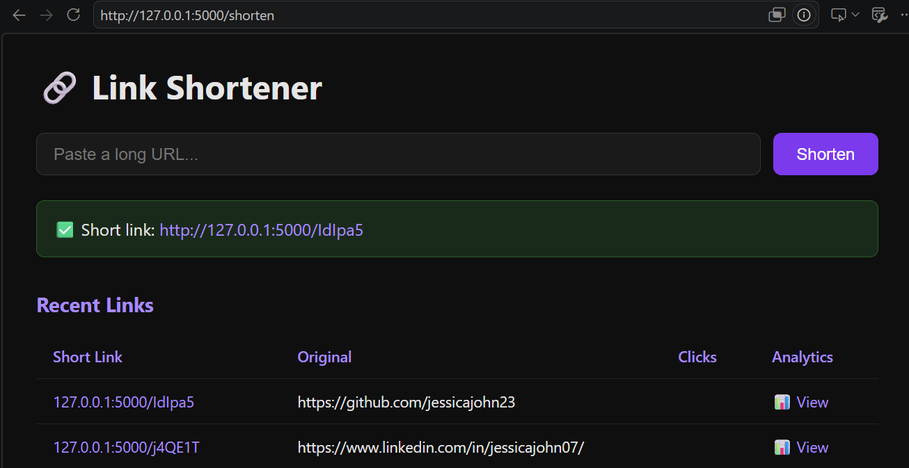
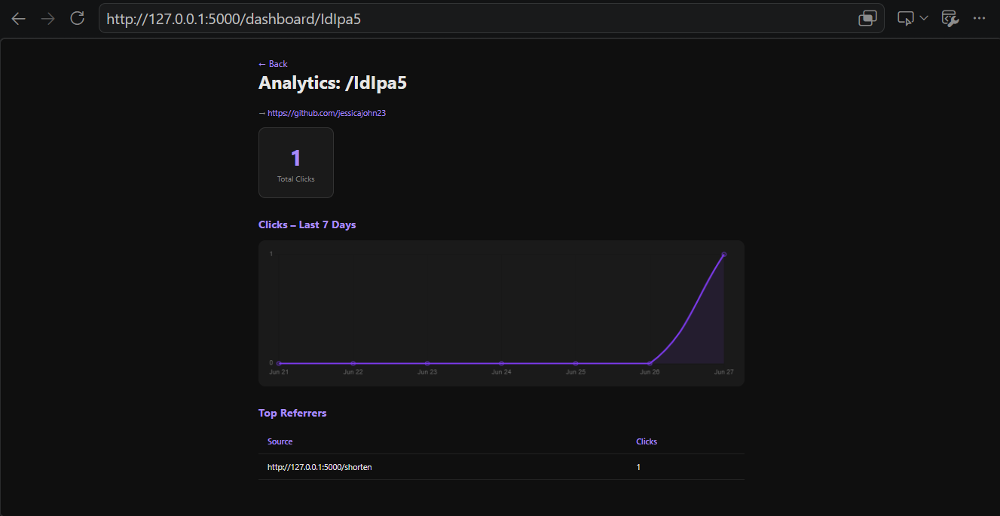

# 🔗 Link Shortener with Analytics

A full-stack URL shortener built with Flask and SQLite. Paste a long URL, get a short link, and track every click with a real-time analytics dashboard.

## Features

- Generate short links instantly
- Click tracking with timestamp, referrer, and user agent logging
- Analytics dashboard with a 7-day click chart (Chart.js)
- Top referrers breakdown
- Lightweight: no external services, runs fully local


## Tech Stack

- Backend: Python, Flask, Flask-SQLAlchemy
- Database: SQLite
- Frontend: HTML, CSS, Chart.js
- ORM: SQLAlchemy


## Getting Started

### Prerequisites

- Python 3.8+
- pip


### Installation

```bash
# Clone the repo
git clone https://github.com/yourusername/link-shortener.git
cd link-shortener

# Create a virtual environment
python -m venv venv
source venv/bin/activate  # Windows: venv\Scripts\activate

# Install dependencies
pip install -r requirements.txt

# Run the app
python app.py
```

Visit `http://localhost:5000`


## Project Structure
link-shortener/

├── app.py              --> Flask routes and app logic

├── models.py           --> SQLAlchemy database models

├── requirements.txt    --> Python dependencies

├── templates/

│   ├── index.html      --> Home page: create and view links

│   └── dashboard.html  --> Analytics dashboard

└── static/

└── style.css       --> Styling


## How It Works

1. User submits a long URL 
2. Flask generates a unique 6-character code and saves it to SQLite
3. Visiting `/<code>` logs a click (timestamp, referrer, IP, user agent) and redirects
4. The analytics dashboard fetches click data via a JSON API endpoint and renders charts


## Planned Features
- Custom short codes
- QR code generation
- Password-protected links
- PostgreSQL support for deployment
- Deploy to Render


## Screenshots




## Author

**Jessica John**  
[GitHub](https://github.com/jessicajohn23) · [LinkedIn](https://linkedin.com/in/jessicajohn07)
